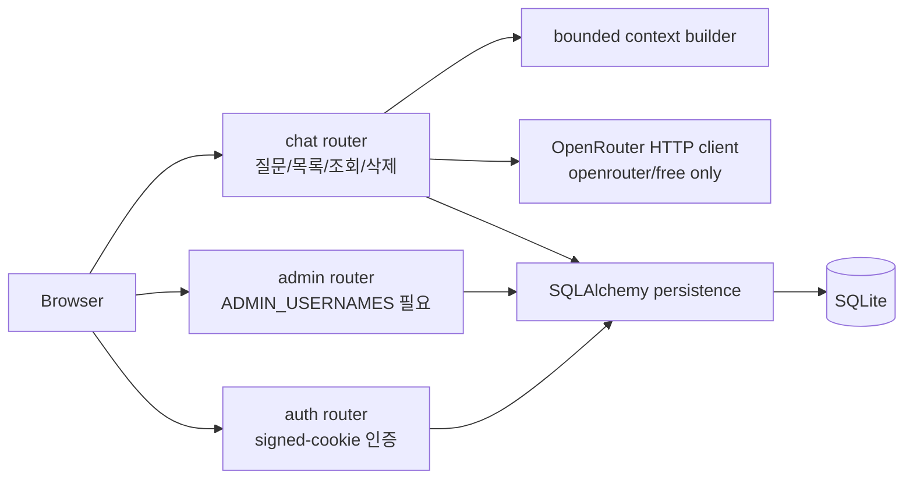
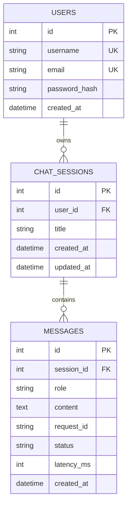

# EVERYTHING

> 궁금한 건 무엇이든.

EVERYTHING은 한국어 사용자가 자연어로 일반 지식 질문을 하고, 간결한
AI 설명과 문맥을 이어받은 후속 답변을 받은 뒤, 이전 대화를 다시 볼 수
있는 대화형 AI 백과사전입니다.

현재 MVP는 자체 지식 검색이나 Wikipedia API를 사용하지 않습니다.
OpenRouter 기반 대화 기능을 먼저 완성했으며, 외부 검색·근거 제시는 향후
확장 영역입니다.

## 문제와 대상 사용자

일반 검색 결과는 정보가 여러 문서에 흩어져 있고, 기존 백과사전은 사용자의
이해 수준에 맞춘 후속 설명이 어렵습니다. EVERYTHING은 다음 사용자를 위해
질문 중심의 읽기 쉬운 설명과 연속 대화를 제공합니다.

- 낯선 개념을 한국어로 빠르게 이해하려는 학습자
- 첫 답변에서 생긴 의문을 같은 문맥으로 이어 묻고 싶은 사용자
- 이전에 공부한 대화를 개인 기록으로 다시 보고 싶은 사용자

대표 흐름은 다음과 같습니다.

```text
회원가입 → 로그인 → 질문 → 최근 문맥 로드 → OpenRouter 호출
→ 답변 저장 → 후속 질문 → 과거 대화 재방문
```

### 왜 이런 컨셉인가

- **범용 챗봇을 그대로 쓰지 않은 이유**: ChatGPT 같은 범용 챗봇은 세션이
  흩어지고 목적이 정해져 있지 않다. EVERYTHING은 "질문 하나 = 세션 하나,
  제목은 그 질문에서 자동 생성"으로 범위를 좁혀, 나중에 "그때 그거 뭐였지"를
  찾기 쉽게 만드는 데 집중한다. 대신 범용 챗봇이 하는 다른 일(코드 작성,
  창작, 멀티모달 등)은 의도적으로 다루지 않는다.
- **정적 백과사전(위키백과 등)을 그대로 쓰지 않은 이유**: 문서와 대상 사용자
  절에 적었듯, 정적 백과사전은 모든 사용자에게 같은 난이도의 글을 보여주고
  후속 질문을 이어갈 방법이 없다. 대화형으로 만들어 "방금 답변을 기준으로 더
  쉽게" 또는 "이거랑 관련해서 이건 어때"를 그대로 이어 물을 수 있게 했다.
- **검색·근거 제시(grounding) 없이 시작한 이유**: grounding은 사실성을
  올리지만, 그 전에 "대화 흐름 + 무료 티어 비용 안전 장치"가 먼저 검증되어야
  의미가 있다고 판단해 MVP 범위에서 뺐다 (`docs/ARCHITECTURE.md`의 "Future
  Extensibility" 참고). 없는 척하지 않고 README에도 명시했다.
- **무료 티어만 쓰기로 한 이유**: 학습/평가 목적 프로젝트에서 실제 과금이
  발생하면 지속 가능하지 않다. 그래서 "OpenRouter 무료 모델만, 유료 fallback
  없음, 질문당 호출 정확히 1회"를 처음부터 하드 제약으로 설계에 넣었다 (아래
  "OpenRouter와 비용 안전" 참고). 이건 기능 제한이 아니라 이 프로젝트가 실제로
  운영 가능한 상태를 유지하기 위한 전제 조건이다.

실제로 다른 점을 정리하면:

| | 범용 챗봇 | 정적 백과사전 | EVERYTHING |
|---|---|---|---|
| 대화 이어가기 | 됨 (세션 관리가 느슨함) | 안 됨 | 됨, 세션 단위로 명확히 구분 |
| 과거 기록 재방문 | 서비스마다 다름 | 해당 없음 | 질문 목록 → 상세 대화로 항상 재방문 가능 |
| 난이도 맞춤 후속 설명 | 가능하지만 목적이 아님 | 안 됨 | 핵심 기능 |
| 비용 안전 장치 | 서비스 제공자 책임 | 해당 없음 | 무료 티어 강제, 유료 전환 코드 자체가 없음 |

> **프론트엔드 스택 변경 (검토 후 승인됨):** 초기 계획은 Jinja2 서버 렌더링
> 템플릿 + vanilla JavaScript였고 Node 빌드 파이프라인은 배제했습니다.
> Agent 2는 실제로 `frontend/` 아래 React 19 + Vite + TypeScript SPA를
> 구현했고, 백엔드와는 순수 JSON API로만 통신합니다. 이미 완성되어 테스트를
> 통과한 UI 코드를 다시 만드는 대신, 검토 후 이 변경을 그대로 승인했습니다.
> `app/templates/`, `app/static/`은 Agent 1의 백엔드 초기화 단계에서 만든
> 최소 placeholder로 남아 있으며 실제로 서비스되는 프론트엔드가 아닙니다.

## 현재 구현 상태

- FastAPI·SQLite·SQLAlchemy 기반 인증과 대화 API 구현
- 서명된 HttpOnly 세션 쿠키와 사용자별 대화 격리 구현
- 최근 메시지를 활용한 후속 질문 문맥 구현
- OpenRouter 무료 모델 강제와 장애 오류 처리 구현
- 구조화된 요청 생명주기 로그와 `request_id` 구현
- 외부 네트워크가 차단된 pytest 검증 구현
- React/Vite/TypeScript SPA (`frontend/`)로 랜딩·로그인·회원가입·채팅 화면 구현
  (35개 vitest 테스트 통과, 타입 오류 0건, 프로덕션 빌드 확인 완료)
- `app/templates/`, `app/static/`의 Jinja2 placeholder는 실제 서비스되지 않음

이 README는 구현되지 않은 Wikipedia grounding을 주장하지 않습니다.

## 기술 구성

- Python, FastAPI, Uvicorn
- SQLite, SQLAlchemy
- React 19, Vite, TypeScript (`frontend/`) — 위 "프론트엔드 스택 변경" 참고
- httpx, OpenRouter
- pytest, pytest-asyncio · vitest (frontend)

Vue, Next.js, Redis, PostgreSQL, Firebase, Supabase, Docker는 사용하지
않습니다. `app/templates/`, `app/static/`은 실제로 서비스되지 않는 초기
placeholder입니다.

## 아키텍처와 책임



요청당 상세 흐름(성공/실패 분기 포함)은 `docs/ARCHITECTURE.md`의
"POST /api/chat request sequence"와 "Auth: race-safe registration +
timing-safe login" 시퀀스 다이어그램을 참고하세요.

| 구성 요소 | 책임 |
|---|---|
| `app/main.py` | 애플리케이션, 예외 처리, `/health`, 채팅 request ID |
| `app/routers/auth.py` | 회원가입, 로그인, 로그아웃, 현재 사용자 |
| `app/routers/chat.py` | 질문, 목록, 상세 조회, 삭제 API |
| `app/routers/admin.py` | 관리자 로그 조회 API (`ADMIN_USERNAMES` 필요) |
| `app/services/ai.py` | OpenRouter 무료 모델 HTTP 경계 |
| `app/services/context.py` | 최근 대화 문맥 구성 및 크기 제한 |
| `app/services/chat.py` | 검증, AI 호출, 저장, 생명주기 로그, 관리자 로그 조회 |
| `app/services/users.py` | `users` 테이블에 직접 접근하는 유일한 모듈 |
| `app/models/` | 사용자, 대화 세션, 메시지 모델 |
| `app/templates/`, `app/static/` | 서버 렌더링 UI와 브라우저 동작 |
| `tests/` | 외부 네트워크 없는 자동 검증 |
| `scripts/` | 평가자용 DB 검사 도구 |

검색·grounding은 향후 별도 retrieval service로 추가할 수 있지만 MVP에는
포함하지 않습니다.

## 데이터베이스



### `users`

`id`, `username`, `email`, `password_hash`, `created_at`

### `chat_sessions`

`id`, `user_id`, `title`, `created_at`, `updated_at`

제목은 첫 사용자 질문의 첫 줄에서 최대 60자를 가져옵니다. 제목 생성을
위한 AI 호출은 없습니다. 후속 질문이 저장되면 `updated_at`이 갱신됩니다.

### `messages`

`id`, `session_id`, `role`, `content`, `request_id`, `status`,
`latency_ms`, `created_at`

## 인증과 사용자 격리

비밀번호는 PBKDF2-HMAC-SHA256과 무작위 salt로 해시해 저장합니다. 가입과
로그인은 사용자 ID와 만료 시각이 들어 있는 서명된 HttpOnly 쿠키를
발급하고, 서버가 각 요청에서 서명과 만료를 검증합니다. 브라우저 JavaScript는
쿠키 값을 읽지 않습니다.

대화 목록·조회·삭제는 모두 현재 사용자 소유권을 검사합니다. 존재하지 않는
대화와 다른 사용자의 대화는 동일한 `NOT_FOUND` 응답을 사용해 대화 존재
여부를 노출하지 않습니다. 로그아웃은 브라우저 쿠키를 삭제합니다.

## 대화 문맥 전략

각 질문은 시스템 프롬프트, 해당 대화의 최근 최대 10개 메시지, 새 질문으로
구성됩니다. 이전 메시지는 합계 6,000자 한도 안에서 최신 메시지부터
선택합니다. 질문 하나당 OpenRouter 호출은 정확히 한 번이며, 제목·요약·분류·
장식·백그라운드 작업을 위한 추가 호출은 없습니다.

## OpenRouter와 비용 안전

유일한 AI endpoint는 다음입니다.

```text
https://openrouter.ai/api/v1/chat/completions
```

애플리케이션은 `OPENROUTER_MODEL=openrouter/free`만 허용합니다. 설정이
비어 있거나 다른 모델로 바뀌면 네트워크 요청 전에 실패합니다. 유료 모델
fallback과 반복 재시도는 없습니다.

테스트는 `test-key`만 사용하고 외부 socket 연결을 차단합니다. 성공, timeout,
429, upstream 500, malformed response를 모두 mock으로 검증하므로 테스트가
무료 일일 사용량을 소비하지 않습니다.

## 환경 변수

`.env.example`을 `.env`로 복사하고 실제 값은 로컬 또는 배포 환경에서만
채웁니다.

| 변수 | 기본/예시 | 설명 |
|---|---|---|
| `APP_ENV` | `development` | 실행 환경 이름 |
| `SECRET_KEY` | 비워 둠 | 세션 서명 키; 운영에서는 긴 무작위 값 필수 |
| `DATABASE_URL` | `sqlite:///./app.db` | SQLite 연결 주소 |
| `OPENROUTER_API_KEY` | 비워 둠 | OpenRouter 키 |
| `OPENROUTER_MODEL` | `openrouter/free` | 변경 불가한 무료 모델 정책 |
| `AI_TIMEOUT_SECONDS` | `20` | AI 요청 timeout |
| `SESSION_COOKIE_NAME` | `everything_session` | 세션 쿠키 이름 |
| `SESSION_HTTPS_ONLY` | `false` | 운영 TLS 환경에서는 `true` |
| `LOG_LEVEL` | `INFO` | 애플리케이션 로그 레벨 |

실제 API 키, `SECRET_KEY`, 쿠키, 비밀번호는 저장소에 커밋하지 않습니다.

## 로컬 설치와 실행

Python 3.11 이상을 권장합니다.

```bash
python3 -m venv .venv
source .venv/bin/activate
python -m pip install -r requirements.txt
cp .env.example .env
```

`.env`의 `SECRET_KEY`와 `OPENROUTER_API_KEY`를 채운 뒤 실행합니다.

```bash
uvicorn app.main:app --reload
```

- 서비스: `http://127.0.0.1:8000`
- API 문서: `http://127.0.0.1:8000/docs`
- 상태 확인: `http://127.0.0.1:8000/health`

시작 시 SQLAlchemy가 없는 테이블을 생성합니다.

## API 명세

| Method | Path | 인증 | 설명 |
|---|---|---:|---|
| `POST` | `/api/auth/register` | 아니요 | 회원가입 및 로그인 쿠키 발급 |
| `POST` | `/api/auth/login` | 아니요 | 로그인 |
| `POST` | `/api/auth/logout` | 아니요 | 브라우저 세션 쿠키 삭제 |
| `GET` | `/api/auth/me` | 예 | 현재 사용자 |
| `POST` | `/api/chat` | 예 | 새 질문 또는 후속 질문 |
| `GET` | `/api/chats` | 예 | 내 대화 목록 |
| `GET` | `/api/chats/{session_id}` | 예 | 내 대화와 메시지 조회 |
| `DELETE` | `/api/chats/{session_id}` | 예 | 내 대화 삭제 |
| `GET` | `/api/admin/logs` | 예 (admin) | 최근 메시지 로그 (`scripts/check_logs.sql`과 동일 데이터) |
| `GET` | `/health` | 아니요 | AI를 호출하지 않는 상태 확인 |

### 인증 예시

```http
POST /api/auth/register
Content-Type: application/json

{"username":"alice","email":"alice@example.com","password":"password123"}
```

```json
{
  "success": true,
  "user": {
    "id": 1,
    "username": "alice",
    "email": "alice@example.com",
    "created_at": "2026-08-08T09:00:00Z"
  }
}
```

### 새 질문과 후속 질문

```http
POST /api/chat
Content-Type: application/json

{"session_id":null,"message":"판 구조론이 뭐야?"}
```

```json
{
  "success": true,
  "session_id": 1,
  "message": {
    "id": 2,
    "role": "assistant",
    "content": "...",
    "created_at": "2026-08-08T09:01:00Z"
  }
}
```

응답의 `X-Request-ID` 헤더는 저장된 두 메시지와 운영 로그의
`request_id`에 대응합니다. 후속 질문은 같은 `session_id`를 사용합니다.

```json
{"session_id":1,"message":"그럼 지진이랑 무슨 관계야?"}
```

### 오류 응답

```json
{
  "success": false,
  "error_code": "AI_RATE_LIMIT",
  "message": "the AI service is rate limited, try again shortly"
}
```

| 코드 | 의미 |
|---|---|
| `EMPTY_INPUT` | 빈 질문 |
| `INPUT_TOO_LONG` | 공백 제거 후 2,000자 초과 |
| `AUTH_REQUIRED` | 인증 필요 |
| `AI_TIMEOUT` | AI timeout |
| `AI_RATE_LIMIT` | OpenRouter 429 |
| `AI_API_ERROR` | 설정, upstream 또는 응답 구조 오류 |
| `DB_SAVE_ERROR` | 대화 저장 실패 |
| `INTERNAL_ERROR` | 예상하지 못한 서버 오류 |
| `USERNAME_TAKEN`, `EMAIL_TAKEN` | 가입 정보 중복 |
| `INVALID_CREDENTIALS` | 로그인 실패 |
| `NOT_FOUND` | 없거나 소유하지 않은 대화 |
| `TOO_MANY_REQUESTS` | 사용자당 60초에 20회를 초과한 채팅 요청 |
| `ADMIN_REQUIRED` | `ADMIN_USERNAMES`에 없는 사용자의 관리자 API 접근 |

세부 응답 형태는 `docs/API_CONTRACT.md`를 참고합니다.

## 테스트

```bash
pytest -q
```

테스트 범위:

- 가입·중복·로그인·잘못된 자격증명·로그아웃
- 비로그인 API 차단과 사용자별 대화 격리
- 빈 입력과 모든 2,000자 초과 입력
- AI 1회 호출, 답변 저장, request ID, 최근 목록 갱신
- 후속 질문 문맥
- timeout, 429, upstream 500, malformed response
- DB 저장 실패와 내부 예외 비노출
- 필수 로그 이벤트와 비밀정보 필터
- `/health` 공개 접근과 AI 호출 0회
- 관리자 로그 라우트 인증/인가
- 사용자당 rate limit
- 테스트 전체의 외부 네트워크 차단

파일별로 무엇을 검증하는지, 의도적으로 무엇을 테스트하지 않는지는
`docs/TESTING.md`에 정리돼 있습니다.

특정 장애 시연은 다음처럼 실제 API 없이 실행할 수 있습니다.

```bash
pytest -q tests/test_ai.py tests/test_operations.py
```

## 데이터베이스 검사

최근 50개 메시지와 request ID, 상태, AI 지연시간을 확인합니다.

```bash
sqlite3 -header -column app.db < scripts/check_logs.sql
```

검사 쿼리는 `password_hash`를 선택하지 않습니다.

## 로깅과 관측성

각 인증된 채팅 처리에는 다음 생명주기 이벤트가 기록됩니다.

```text
request_received
ai_call_start
ai_call_success 또는 ai_call_failed
db_save_success 또는 db_save_failed
```

로그 필드는 `request_id`, 가능한 경우 `user_id`, `session_id`, AI 작업의
`latency_ms`, 제어된 `error_code`입니다. 전체 질문·답변은 기록하지 않으며,
필드명에 password, secret, token, cookie, authorization, API key가 포함되면
값을 버립니다. 예상하지 못한 예외는 형식 이름만 기록하고 클라이언트에는
`INTERNAL_ERROR`를 반환합니다.

## 배포

이 MVP는 한 개의 FastAPI 인스턴스와 영구 SQLite 파일을 전제로 합니다.
운영 환경에서는 TLS reverse proxy 뒤에서 다음처럼 실행할 수 있습니다.

```bash
uvicorn app.main:app --host 127.0.0.1 --port 8000
```

반드시 다음을 적용합니다.

- 길고 무작위인 운영용 `SECRET_KEY`
- `OPENROUTER_MODEL=openrouter/free`
- TLS와 `SESSION_HTTPS_ONLY=true`
- 영구 저장소의 SQLite 경로와 정기 백업
- `.env` 외부 보관 및 로그 접근 제한
- 배포 전 전체 pytest와 `/health` 확인

전체 절차와 현재 한계는 `docs/DEPLOYMENT_CHECKLIST.md`에 있습니다.

## 평가자 시연

가입부터 후속 질문, 저장 기록, mock 장애, 로그, Git과 `.env` 확인까지의
짧은 순서는 `docs/EVALUATOR_CHECKLIST.md`를 사용합니다.

## 팀 역할과 기여

| 담당 | 영역 | 현재 기여 |
|---|---|---|
| Agent 1 | Backend / AI / Architecture | DB 모델, 인증, chat/history API, 문맥, OpenRouter, 기본 로그 |
| Agent 2 | Frontend / UX | React/Vite/TypeScript SPA 구현 완료 (`frontend/`); 백엔드 JSON API 연동 완료 |
| Agent 3 | QA / Operations / Documentation | 테스트 안전망, 비용·로그 보완, DB 검사, README, 평가·배포 문서 |

소유권 세부사항은 `docs/TEAM.md`, 작업 목록은 `docs/TASKS.md`에 있습니다.

## 브랜치와 PR 흐름

```text
main ← develop ← feature/core-backend-ai
               ← feature/frontend-experience
               ← feature/qa-ops-docs
```

- 기능 브랜치는 `develop`에서 시작합니다.
- 작은 의미 단위로 conventional commit을 작성합니다.
- PR 대상은 `develop`입니다.
- 다른 담당 영역의 변경은 결함 증거와 최소 수정으로 제한합니다.
- 의미 있는 기여 이력을 단순 미관을 위해 squash하지 않습니다.

### 병합된 PR

| # | 제목 | 담당 |
|---|---|---|
| [#2](https://github.com/VectorSophie/codyssey-b7-1/pull/2) | feat(backend): FastAPI + SQLite backend, auth, and OpenRouter chat | Agent 1 |
| [#1](https://github.com/VectorSophie/codyssey-b7-1/pull/1) | test(qa): verify operations and evaluator readiness | Agent 3 |
| [#6](https://github.com/VectorSophie/codyssey-b7-1/pull/6) | feat(frontend): Agent 2 Frontend / UX / Visual Design 구현 완료 | Agent 2 |
| [#7](https://github.com/VectorSophie/codyssey-b7-1/pull/7) | release: backend, React frontend, QA suite, and Render deploy | 전체 |
| [#8](https://github.com/VectorSophie/codyssey-b7-1/pull/8) | fix(ai): stop openrouter/free from routing to non-chat models | Agent 1 |
| [#9](https://github.com/VectorSophie/codyssey-b7-1/pull/9) | release: fix openrouter/free routing to non-chat models + review hardening | 전체 |

## 민감정보 처리

- `.env`, `.env.*`, `*.db`, 로그, 가상환경은 Git에서 제외됩니다.
- `.env.example`만 예외로 추적하며 실제 값은 비워 둡니다.
- API 키와 세션 키를 코드에 하드코딩하지 않습니다.
- 비밀번호, 쿠키, 전체 Authorization 헤더, API 키를 로그에 남기지 않습니다.
- 테스트는 개발자의 실제 환경값을 덮어쓰고 외부 네트워크를 차단합니다.
