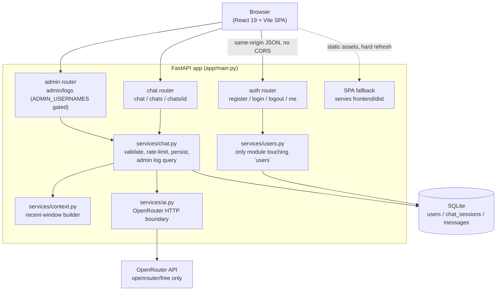
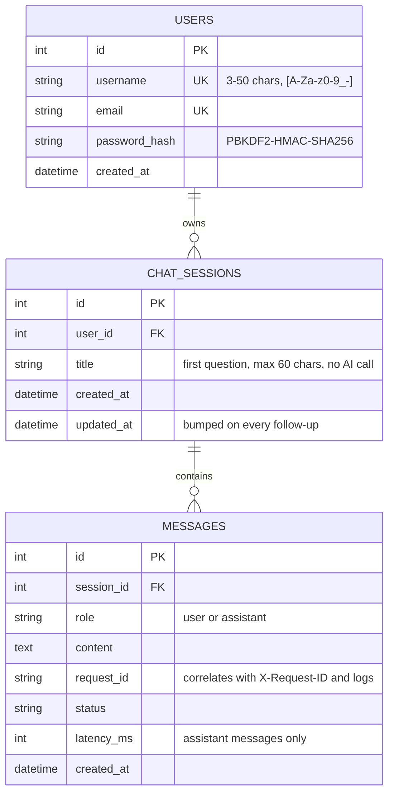
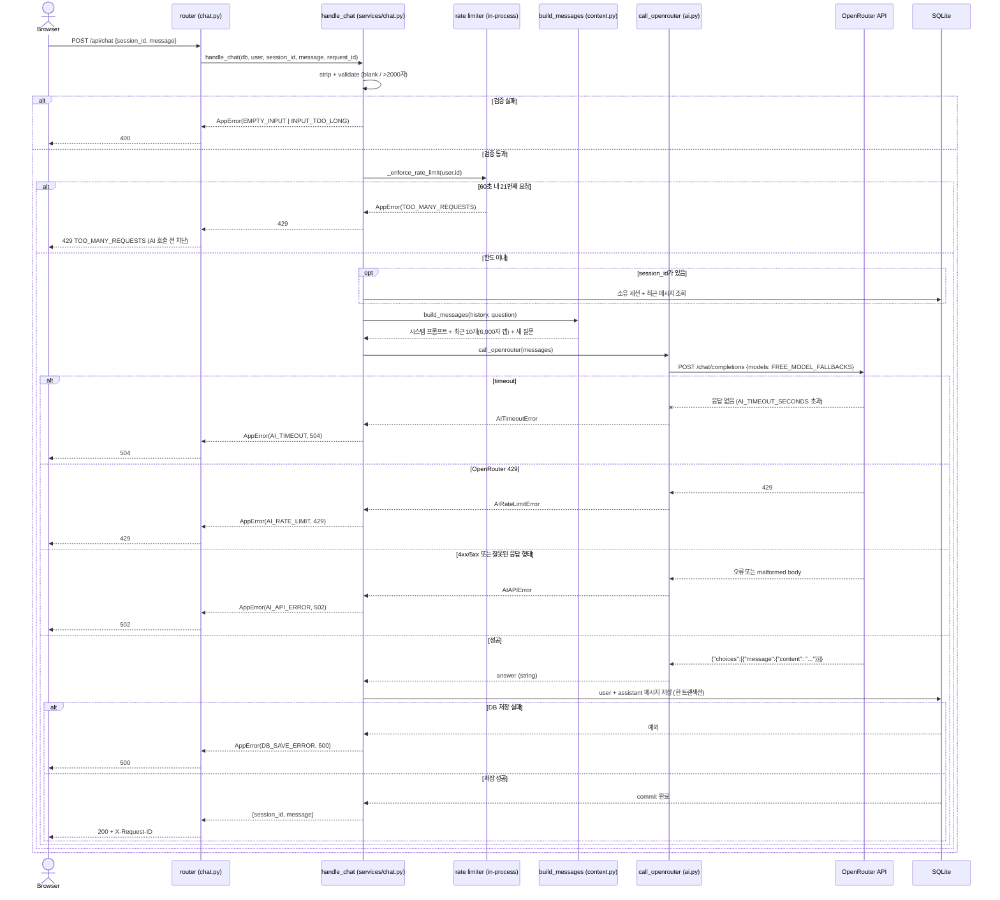
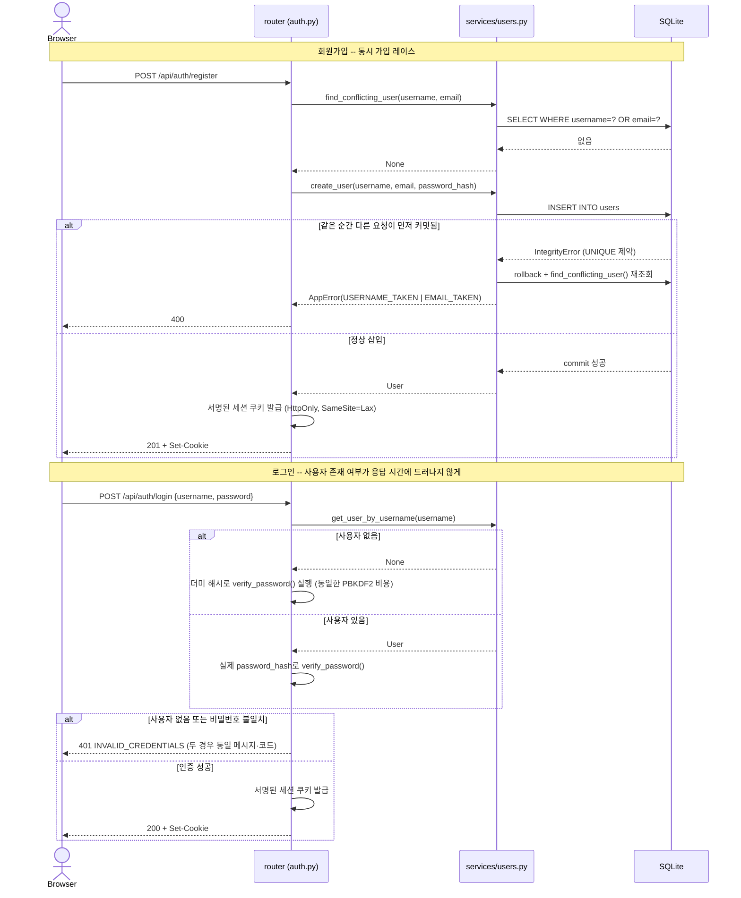

# Architecture — EVERYTHING

> Looking for which file does what, or where a specific concept (async,
> dependency injection, rate limiting, ...) lives in code? See
> `docs/FILE_MAP.md`.

## Flow



## Frontend

**Deviation from the original plan, reviewed and accepted:** the project
was originally scoped for Jinja2 server-rendered templates + vanilla
JavaScript, explicitly ruling out React/Vue/Next.js and a Node build
pipeline, to keep the stack simple and evaluable. Agent 2 built the
frontend as a React 19 + Vite + TypeScript single-page app under
`frontend/`, calling the backend purely as a JSON API (see
`frontend/src/api/client.ts`), rather than using `app/templates/` +
`app/static/`. This was accepted after review rather than rebuilt, since
it was already working, tested UI code and a full rewrite would have
discarded that work for a stylistic-only gain. `app/templates/` and
`app/static/` remain in the repo as the minimal placeholder pages from
Agent 1's backend bootstrap; they are not the served frontend.

## Backend

FastAPI. Server-side session/auth handling (no client-side token
management beyond a session cookie).

## Persistence

SQLite via SQLAlchemy. Core tables: `users`, `chat_sessions`, `messages`.
See `docs/API_CONTRACT.md` for the request/response shapes these back.



`chat_sessions` -> `messages` cascades on delete (`cascade="all,
delete-orphan"` in `app/models/chat.py`), so `DELETE /api/chats/{id}`
removes the session's messages in the same transaction — no orphaned rows.

## AI Integration

OpenRouter only, via `https://openrouter.ai/api/v1/chat/completions`,
using the `openrouter/free` model exclusively. One AI call per user
question — no AI calls for titles, summaries, classification, moderation,
or background/prefetch work. At most one controlled retry on transient
network failure (preferably none). The app must remain usable if
OpenRouter is unavailable or rate-limited (return `AI_TIMEOUT` /
`AI_RATE_LIMIT` / `AI_API_ERROR` and preserve the user's question).

### `POST /api/chat` request sequence

Every branch below is a real path in `app/services/chat.py::handle_chat`,
not an idealized happy path — including the rate limiter added after the
AI pre-evaluation review and the three distinct AI failure modes.



### Auth: race-safe registration + timing-safe login



## Context Strategy

Approximately the most recent 10 messages of a conversation, subject to a
bounded character/token cap, sent as context on each new question.

## Conversation Titles

Derived directly from the first user question in a session (no AI call
involved).

## Operational Logging

Structured events per chat request, all tagged with a `request_id`:

```
request_received
ai_call_start
ai_call_success
ai_call_failed
db_save_success
db_save_failed
```

Never log passwords, API keys, session cookies, or full auth headers.
Avoid logging full conversation content unless explicitly needed for
debugging a specific issue.

## Future Extensibility (not built now)

Retrieval/grounding (e.g. Wikipedia API integration) is explicitly out of
scope for the MVP. The context/service layering should not preclude adding
it later, but no groundwork beyond that should be built speculatively now.

## Design decisions (evaluator Q&A)

Questions raised during review, answered here rather than only verbally,
since undocumented reasoning reads as luck rather than intent.

**Why is `handle_chat` `async` when only one line (`await
call_openrouter(...)`) actually awaits anything?** That single await is the
only I/O in the request that can take a meaningful amount of wall-clock
time — up to `AI_TIMEOUT_SECONDS` (20s) waiting on OpenRouter. Everything
else in the function is synchronous SQLite work, which is fast enough that
making it async too would add complexity (an async DB driver, an async
session lifecycle) without a measurable benefit at this project's scale —
one FastAPI process, one SQLite file, low concurrency. The point of the
`await` is that while it's waiting on the network, the event loop is free
to run other requests; a fully synchronous handler could not do that. It's
not "async because the language allows it everywhere" — it's async at
exactly the one point where yielding control is worth something. This
tradeoff is also called out as a known limit in
`docs/DEPLOYMENT_CHECKLIST.md` (the sync session is still held open across
that await); the fix if this ever needs to scale further is a fully async
DB session, not sprinkling more `await` in.

**Why no streaming?** Streaming is the SSE/WebSocket-shaped version of a
much bigger scope: partial-response persistence, mid-stream failure
handling, and a client that can resume or discard a half-received answer.
The project's hard constraint is "exactly one OpenRouter call per
question, at most one controlled retry" — getting *that* reliable already
took real debugging work (see the `openrouter/free` auto-router incident
in `app/services/ai.py` and PR #8/#9). Streaming would multiply the
failure surface of an already fragile free-tier dependency for a UX gain
that isn't part of the evaluated spec. It's a reasonable next step, not an
oversight — the response shape (`session_id` + one `message`) doesn't
preclude adding it later.

**Why `raise AppError(...)` instead of returning an error value?**
(`app/dependencies.py::require_auth`, `app/services/chat.py::get_owned_session`,
and every validation check in `handle_chat`.) Domain errors here are
translated to HTTP responses by one central handler
(`app.errors.AppError` -> caught in `app/main.py`), not by the caller.
Returning error values instead would mean every router function has to
remember to check and translate them — easy to forget, and each miss is a
silent 200 with a wrong body. Raising makes "this request cannot
continue" impossible to accidentally ignore: it either gets deliberately
caught, or it propagates to the one place that turns it into the correct
status code and `error_code`. Return values are still used everywhere the
result is genuinely optional data, not an error — e.g. `get_current_user`
returns `User | None` because "not logged in" is a normal state a caller
is expected to branch on, not a failure to short-circuit.

**Why no CSRF token, given cookies are used for auth?** The session cookie
is `SameSite=Lax` (`app/routers/auth.py::_set_session_cookie`), which
browsers already withhold on cross-site POST/PUT/DELETE requests (it's only
sent on top-level navigation, i.e. plain GET-by-link) -- that blocks the
classic auto-submitting-form CSRF attack without a token. Combined with
there being no CORS middleware (the SPA and API are same-origin, per
`app/main.py`), a cross-site `fetch`/XHR can't attach the cookie either. A
CSRF token would be redundant defense-in-depth here, not a missing control.

**What stops a duplicate `POST /api/chat` (double-click, flaky network
retry) from creating two AI calls and two messages for one question?**
The frontend (`ChatPage.tsx`'s `chatSubmitLockRef` plus `isSending`)
prevents this from the UI, but that's a client-side convenience, not a
guarantee -- a raw duplicate HTTP request (curl, a retrying proxy) isn't
stopped by it. There is no server-side idempotency key. This is a real,
accepted gap for the MVP: true idempotency (client-generated request key,
server dedupes by it) is the correct fix if this becomes a problem, but
wasn't built speculatively without a concrete failure driving it. The
per-user rate limit below is a different, coarser guard: it caps sustained
abuse, not a single accidental double-submit.

**Why is auth a `Depends()` dependency (`app/dependencies.py::require_auth`)
instead of global ASGI middleware?** This is the FastAPI-idiomatic choice,
not a missing piece. Middleware runs before route matching, so it can't
tell a protected route from a public one without a hand-maintained path
allowlist (exactly the kind of thing `/health`, `/api/auth/register`, and
the SPA catch-all in `app/main.py` would need to be excluded from,
manually, forever). A per-route dependency instead: (1) shows up in the
auto-generated OpenAPI docs as that route's actual security requirement,
(2) is what `app.dependency_overrides` hooks into for every test in this
suite (`tests/conftest.py`), which a middleware can't participate in the
same way, and (3) keeps "is this route protected" answerable by reading
the route's own signature instead of cross-referencing a separate
middleware file. Real teams have moved *from* middleware auth *to*
per-route dependencies for these reasons, not the other direction — see
["Enhancing Authentication in FastAPI: Transitioning from Middleware to
Router-Level
Dependencies"](https://medium.com/@anto18671/efficiency-of-using-dependencies-on-router-in-fastapi-c3b288ac408b).
The one thing this project *does* use middleware for
(`attach_chat_request_id` in `app/main.py`) is a genuine cross-cutting,
route-agnostic concern (every request gets a correlation id) — which is
exactly the case middleware is for.

**Why no repository/CRUD layer per model, given `app/services/chat.py`
queries `ChatSession`/`Message` directly with the SQLAlchemy `Session`?**
The failure mode a repository layer prevents is DB-access code "sprinkled
all over the codebase" so nothing can find or change it safely (this is
the standard argument for it — see ["Repository and Unit of Work
Pattern"](https://www.cosmicpython.com/blog/2017-09-08-repository-and-unit-of-work-pattern-in-python)
and the SQLAlchemy Session being called out as too easy to query from
anywhere). This project already prevents that a different way: exactly one
module owns each table's writes and non-trivial reads --
`app/services/chat.py` for `chat_sessions`/`messages`,
`app/services/users.py` for `users` (see `find_conflicting_user`,
`get_user_by_username`, `create_user`) — and every router (`auth.py`,
`chat.py`) calls into those, never the DB directly. A `Repository` class
per model here would be a same-named wrapper around functions that already
live in exactly one place; for 3 tables and one process it adds a layer of
indirection without adding a capability the project doesn't already have.
The concrete trigger for actually adding one: swapping SQLite for
something where the session's transaction boundary needs to be explicit
and reusable across multiple call sites (a real Unit of Work), which this
project's scale hasn't hit.

**Why did `app/routers/chat.py` used to have DB queries directly in two
routes (`list_chats`, `delete_chat`) while `post_chat`/`get_chat` went
through `app/services/chat.py`?** It shouldn't have — that was a real
inconsistency, not an intentional layering choice, caught in review. Fixed
by moving the query and the delete into `list_sessions()` /
`delete_session()` in `app/services/chat.py`, so routers now only do HTTP
wiring (parse the request, call one service function, shape the response)
and every DB access lives in the service layer. `app/routers/auth.py` had
the same problem (`db.query(User)...` directly in `register`/`login`) --
fixed the same way, into the new `app/services/users.py`.

**Where's the admin-facing database view?** The `/admin` React page reads
`GET /api/admin/database` (`app/routers/admin.py`), gated by `require_admin`
(`app/dependencies.py`) checking `ADMIN_USERNAMES`. It returns all rows from
the three application tables with their key relationships, but excludes the
authentication secret `users.password_hash`. `GET /api/admin/logs` remains
available for a message-centered joined view. See "Admin database access" in
`docs/API_CONTRACT.md` for the authorization and cache rules.

## Documentation-to-PR traceability

Every non-trivial doc claim above should be checkable against the PR that
introduced it, not just taken on faith:

| Decision / doc section | PR |
|---|---|
| Initial backend, auth, chat API, OpenRouter integration | [#2](https://github.com/VectorSophie/codyssey-b7-1/pull/2) |
| React/Vite frontend deviation (accepted) | [#6](https://github.com/VectorSophie/codyssey-b7-1/pull/6), [#7](https://github.com/VectorSophie/codyssey-b7-1/pull/7) |
| QA test suite, evaluator/deployment docs | [#1](https://github.com/VectorSophie/codyssey-b7-1/pull/1), [#7](https://github.com/VectorSophie/codyssey-b7-1/pull/7) |
| `openrouter/free` auto-router fix (non-chat model routing) | [#8](https://github.com/VectorSophie/codyssey-b7-1/pull/8), [#9](https://github.com/VectorSophie/codyssey-b7-1/pull/9) |
| Router/service abstraction fix (chat), async/streaming/raise-vs-return Q&A | [#10](https://github.com/VectorSophie/codyssey-b7-1/pull/10) |
| Per-user chat rate limit, CSRF/idempotency Q&A | [#10](https://github.com/VectorSophie/codyssey-b7-1/pull/10) |
| `app/services/users.py` extraction, admin log route, auth-middleware/repository-pattern Q&A | [#10](https://github.com/VectorSophie/codyssey-b7-1/pull/10) |

Update this table in the same PR that changes the architecture it
describes -- an undated claim is worth less than the commit that backs it.
